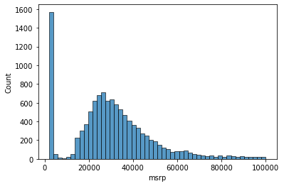
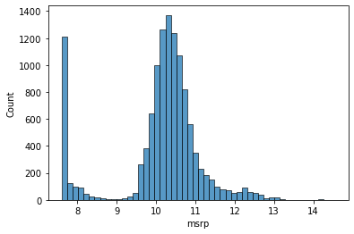

# Exploratory Data Analysis

Welcome back to lesson three of machine learning Zoom session two. In the previous lesson, we delved into examining the columns of our data frame to understand their meaning. Now, in this lesson, we will embark on exploratory data analysis (EDA) to gain a deeper understanding of the dataset. Specifically, we want to get a feel for the values within each column and gain insights into the data and the problem at hand.

## Understanding the Data

First, let's recap what we know about our data. We have a mixture of string and numeric columns, which represent various characteristics of cars. These columns include information about the make and model of the car, the year it was produced, its engine details, transmission type, and more.

Let's start by iterating over each column and examining its unique values and how many unique values there are:

```python
import pandas as pd

# Iterate over columns and display unique values
for col in df.columns:
    print(col)
    print(df[col].unique()[:5])  # Display the first 5 unique values
    print(df[col].nunique())    # Display the number of unique values
    print()
```

Here's a summary of what we found for some of the columns:

- **Make**: Contains car manufacturers such as 'bmw,' 'audi,' 'fiat,' etc., with 48 unique manufacturers.
- **Model**: Contains specific car models, with a vast variety of 914 unique models.
- **Year**: Represents the year of manufacture, with 28 unique years.
- **Engine Fuel Type**: Describes the type of fuel the engine uses, with 10 unique fuel types.
- **Engine Horsepower**: Indicates the engine's power in horsepower, with 356 unique values.
- **Engine Cylinders**: Specifies the number of engine cylinders, with 9 unique values.
- **Transmission Type**: Provides information about the transmission, with 5 unique types.
- **Driven Wheels**: Describes the type of wheels driven by the car, with 4 categories.
- **Number of Doors**: Indicates the number of car doors, with 3 unique values and some missing data (NaN).
- **Market Category**: Categorizes cars into various market categories, with 71 unique categories.
- **Vehicle Size**: Specifies the size of the vehicle, with 3 categories (compact, midsize, large).
- **Vehicle Style**: Describes the style of the vehicle, with 16 unique styles.
- **Highway MPG**: Represents the miles per gallon on the highway, with 59 unique values.
- **City MPG**: Indicates the miles per gallon in the city, with 69 unique values.
- **Popularity**: Reflects the car's popularity, with 48 unique values.
- **MSRP**: Represents the car's price (Manufacturer's Suggested Retail Price), with a wide range of 6049 unique prices.

## Analyzing Price Distribution

Now, let's focus on the price (MSRP) column. Understanding the distribution of prices is crucial as it can significantly impact our machine learning models. We'll visualize the distribution of prices using two Python libraries: `matplotlib` and `seaborn`.

```python
import matplotlib.pyplot as plt
import seaborn as sns
import numpy as np

# Ensure plots are displayed in the notebook
%matplotlib inline

# Plot a histogram of the MSRP column
sns.histplot(df.msrp[df.msrp < 100000], bins=50)
```




The histogram reveals the distribution of car prices. It shows that most car prices are concentrated in a lower range, with a few exceptionally expensive cars. This distribution is typical for prices and is known as a "long-tail distribution." It means that there are many cheaper cars, but only a few extremely expensive ones.

However, long-tail distributions can be challenging for machine learning models. To mitigate this, we can apply a logarithmic transformation to the price column. This transformation helps compress the price values, making them more suitable for modeling. We'll use the `log1p` function from the `numpy` library, which adds 1 to all values before taking the logarithm to avoid issues with zero values.

```python
# Apply the logarithmic transformation to the price column
price_logs = np.log1p(df.msrp)

# Plot a histogram of the transformed prices
sns.histplot(price_logs, bins=50)
```



After the logarithmic transformation, the price distribution takes on a more "normal" shape, resembling a bell curve. This distribution is more favorable for machine learning models, as they tend to perform better when the target variable follows a normal distribution.

## Handling Missing Values

Before we conclude this lesson, let's address the issue of missing values in our dataset. Missing values can pose challenges when training machine learning models. We need to determine how to handle these missing values effectively.

To identify columns with missing values, we can use the `isnull` method and `sum` function:

```python
# Check for missing values in each column and sum them
df.isnull().sum()
```

The result will show us how many missing values exist in each column. Some columns, such as "Number of Doors" and "Market Category," have missing data that we will need to address during data preprocessing before training our machine learning model.

In the next lesson, we will delve into setting up a validation framework to ensure the effectiveness of our model. Validating the model's performance is crucial before training it on the entire dataset.

Stay tuned for the next lesson, where we'll continue our journey into machine learning with Python!

**Note**: The code snippets provided here are for demonstration purposes and should be adapted to your specific dataset and analysis goals.