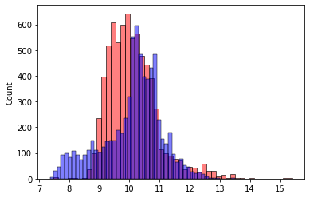

# Building a Baseline Model for Car Price Prediction

In this lesson, we will walk through the process of building a baseline model for predicting the price of a car using Python and Jupyter Notebook. We will leverage code snippets to illustrate each step of the process.

## Introduction

Predicting the price of a car is a common machine learning task, and it's often used as a starting point for more complex modeling. In this article, we will follow these steps:

1. Data Exploration
2. Data Preparation
3. Building the Baseline Model
4. Evaluating the Model

Let's get started with the code snippets!

## Data Exploration

```python
# Check the data types of columns
df_train.dtypes
```

The code above loads the training dataset and displays the data types of each column. Understanding the data types is crucial for feature selection and data preparation.

```python
# Display column names
df_train.columns
```

We also display the column names to get an overview of the available features.

## Data Preparation

For our baseline model, we'll focus on a subset of numerical columns. Here are the columns we've chosen: 'engine_hp', 'engine_cylinders', 'highway_mpg', 'city_mpg', and 'popularity'.

```python
# Selecting the features for the baseline model
base = ['engine_hp', 'engine_cylinders', 'highway_mpg', 'city_mpg', 'popularity']

# Extracting the feature values and target variable
X_train = df_train[base].fillna(0).values
y_train = df_train['price'].values
```

We've selected these features and handled missing values by filling them with zeros. This is a simple approach for the baseline model. For a more advanced model, you might use different techniques to handle missing data.

## Building the Baseline Model

```python
# Train the linear regression model
w0, w = train_linear_regression(X_train, y_train)
```

Here, we train a linear regression model using the selected features and target variable. The function `train_linear_regression` is assumed to be defined elsewhere in your code.

```python
# Make predictions using the trained model
y_pred = w0 + X_train.dot(w)
```

We use the trained model to make predictions on the training data.

## Evaluating the Model

Now, let's visualize how well our baseline model's predictions match the actual car prices.

```python
import seaborn as sns
import matplotlib.pyplot as plt

# Plotting the predictions and actual prices
sns.histplot(y_pred, color='red', alpha=0.5, bins=50, label='Predictions')
sns.histplot(y_train, color='blue', alpha=0.5, bins=50, label='Actual Prices')

# Adding labels and legend
plt.xlabel('Price')
plt.ylabel('Count')
plt.legend()

# Display the plot
plt.show()
```



In this code snippet, we create a histogram plot to compare the predicted car prices (in red) with the actual prices (in blue). This visualization helps us understand how well the model performs. From the plot, we can see that the model's predictions do not align perfectly with the actual prices, indicating room for improvement.

## Conclusion

In this article, we walked through the process of building a baseline model for car price prediction using Python and Jupyter Notebook. We began with data exploration and preparation, selected relevant features, and trained a simple linear regression model. Finally, we visualized the model's predictions and actual prices to assess its performance.

Keep in mind that this is just the starting point, and there are various ways to improve the model's accuracy, such as feature engineering, hyperparameter tuning, and using more advanced regression techniques. Evaluating the model using appropriate metrics like Root Mean Square Error (RMSE) is also essential to objectively measure its performance. In future lessons, we will explore these aspects in more detail.