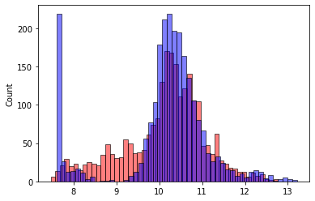

# Enhancing Our Model with Feature Engineering

Welcome to **lesson 11** of the Machine Learning Zoom Camp session two. In this lesson, we're going to turbocharge our model by adding more features to it. Specifically, we'll focus on a variable called "year" and use it to create a new feature called "age" for predicting car prices. Let's dive into the details.

## The Significance of the "Year" Variable

First, let's revisit our training dataset. Within this dataset, we have a variable named "year," which happens to be one of the most crucial factors in predicting the price of a car. Generally, the age of a car plays a significant role in determining its value. Older cars tend to be cheaper, while newer ones are more expensive.

Our goal here is to utilize this "year" variable more effectively. Instead of merely using it as a standalone feature, we'll calculate the age of each car based on the year it was manufactured. But before we proceed, we need to know the reference year for this dataset. In this case, the data was collected in 2017, so we'll assume that as our reference year.

## Calculating Car Age

With the reference year in mind (2017), we can calculate the age of each car in the dataset. This means that cars manufactured in 2017 are 0 years old, while those from earlier years will have a positive age value. We'll add this newly calculated "age" feature to our dataset to enhance our model's predictive power.

Here's how we can compute the car age:

```python
2017 - df_train.year
```

## Feature Engineering

Now that we have our "age" feature, let's modify our `prepare_X` function to incorporate it. Here's the updated function:

```python
def prepare_X(df):
    df = df.copy()
    df['age'] = 2017 - df.year
    features = base + ['age']
    
    df_num = df[features]
    df_num = df_num.fillna(0)
    return df_num.values
```

The function now includes "age" as one of the features and ensures that our original dataset remains unaltered by creating a copy. This way, when users call the function, it won't accidentally modify their dataframes.

## Model Improvement

With our newly engineered feature, let's see how it impacts our model's performance. We'll train the model using the updated dataset and compare the results.

```python
# Train
X_train = prepare_X(df_train)
w0, w = train_linear_regression(X_train, y_train)

# Validation
X_val = prepare_X(df_val)
y_pred = w0 + X_val.dot(w)

rmse(y_val, y_pred)
```

The root mean square error (RMSE) is a critical metric for evaluating the model's performance. In this case, we see a substantial improvement in our model's performance. The RMSE has decreased from 0.76 to 0.51, indicating that our model is now making more accurate predictions.

## Visualization of Model Improvement

To visualize the improvement, we can plot the predicted values against the actual values using a histogram:

```python
import seaborn as sns

sns.histplot(y_pred, color='red', alpha=0.5, bins=50)
sns.histplot(y_val, color='blue', alpha=0.5, bins=50)
```



This histogram shows that our predictions (in red) are now much closer to the actual values (in blue) compared to our previous model.

## What's Next?

Our journey through the Machine Learning Zoom Camp continues, and we've made significant progress by adding a new feature through feature engineering. In the next lesson (lesson 12), we will delve into the fascinating world of categorical variables, which include columns like "make," "model," and more. Stay tuned as we continue to enhance our machine learning skills and build more powerful models!