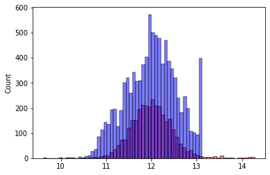

```python
import pandas as pd
import numpy as np
import matplotlib.pyplot as plt
import seaborn as sns

%matplotlib inline
```

## Dataset


```python
data = 'https://raw.githubusercontent.com/alexeygrigorev/datasets/master/housing.csv'
```


```python
!wget $data
```

    --2023-09-20 11:30:14--  https://raw.githubusercontent.com/alexeygrigorev/datasets/master/housing.csv
    Resolving raw.githubusercontent.com (raw.githubusercontent.com)... 185.199.110.133, 185.199.111.133, 185.199.108.133, ...
    Connecting to raw.githubusercontent.com (raw.githubusercontent.com)|185.199.110.133|:443... connected.
    HTTP request sent, awaiting response... 200 OK
    Length: 1423529 (1,4M) [text/plain]
    Saving to: 'housing.csv'
    
         0K .......... .......... .......... .......... ..........  3% 4,40M 0s
        50K .......... .......... .......... .......... ..........  7% 77,0M 0s
       100K .......... .......... .......... .......... .......... 10%  155M 0s
       150K .......... .......... .......... .......... .......... 14%  206M 0s
       200K .......... .......... .......... .......... .......... 17% 9,39M 0s
       250K .......... .......... .......... .......... .......... 21% 66,5M 0s
       300K .......... .......... .......... .......... .......... 25% 9,59M 0s
       350K .......... .......... .......... .......... .......... 28% 23,3M 0s
       400K .......... .......... .......... .......... .......... 32%  123M 0s
       450K .......... .......... .......... .......... .......... 35% 8,45M 0s
       500K .......... .......... .......... .......... .......... 39%  126M 0s
       550K .......... .......... .......... .......... .......... 43% 27,1M 0s
       600K .......... .......... .......... .......... .......... 46% 36,4M 0s
       650K .......... .......... .......... .......... .......... 50%  155M 0s
       700K .......... .......... .......... .......... .......... 53% 8,69M 0s
       750K .......... .......... .......... .......... .......... 57% 23,5M 0s
       800K .......... .......... .......... .......... .......... 61%  219M 0s
       850K .......... .......... .......... .......... .......... 64% 12,8M 0s
       900K .......... .......... .......... .......... .......... 68%  149M 0s
       950K .......... .......... .......... .......... .......... 71%  188M 0s
      1000K .......... .......... .......... .......... .......... 75%  157M 0s
      1050K .......... .......... .......... .......... .......... 79% 12,6M 0s
      1100K .......... .......... .......... .......... .......... 82%  199M 0s
      1150K .......... .......... .......... .......... .......... 86%  210M 0s
      1200K .......... .......... .......... .......... .......... 89%  142M 0s
      1250K .......... .......... .......... .......... .......... 93% 31,9M 0s
      1300K .......... .......... .......... .......... .......... 97%  223M 0s
      1350K .......... .......... .......... ..........           100%  154M=0,05s
    
    2023-09-20 11:30:15 (24,8 MB/s) - 'housing.csv' saved [1423529/1423529]
    
    

## EDA


```python
df = pd.read_csv('housing.csv')
```


```python
df.head()
```


<div>
<style scoped>
    .dataframe tbody tr th:only-of-type {
        vertical-align: middle;
    }

    .dataframe tbody tr th {
        vertical-align: top;
    }

    .dataframe thead th {
        text-align: right;
    }
</style>
<table border="1" class="dataframe">
  <thead>
    <tr style="text-align: right;">
      <th></th>
      <th>longitude</th>
      <th>latitude</th>
      <th>housing_median_age</th>
      <th>total_rooms</th>
      <th>total_bedrooms</th>
      <th>population</th>
      <th>households</th>
      <th>median_income</th>
      <th>median_house_value</th>
      <th>ocean_proximity</th>
    </tr>
  </thead>
  <tbody>
    <tr>
      <th>0</th>
      <td>-122.23</td>
      <td>37.88</td>
      <td>41.0</td>
      <td>880.0</td>
      <td>129.0</td>
      <td>322.0</td>
      <td>126.0</td>
      <td>8.3252</td>
      <td>452600.0</td>
      <td>NEAR BAY</td>
    </tr>
    <tr>
      <th>1</th>
      <td>-122.22</td>
      <td>37.86</td>
      <td>21.0</td>
      <td>7099.0</td>
      <td>1106.0</td>
      <td>2401.0</td>
      <td>1138.0</td>
      <td>8.3014</td>
      <td>358500.0</td>
      <td>NEAR BAY</td>
    </tr>
    <tr>
      <th>2</th>
      <td>-122.24</td>
      <td>37.85</td>
      <td>52.0</td>
      <td>1467.0</td>
      <td>190.0</td>
      <td>496.0</td>
      <td>177.0</td>
      <td>7.2574</td>
      <td>352100.0</td>
      <td>NEAR BAY</td>
    </tr>
    <tr>
      <th>3</th>
      <td>-122.25</td>
      <td>37.85</td>
      <td>52.0</td>
      <td>1274.0</td>
      <td>235.0</td>
      <td>558.0</td>
      <td>219.0</td>
      <td>5.6431</td>
      <td>341300.0</td>
      <td>NEAR BAY</td>
    </tr>
    <tr>
      <th>4</th>
      <td>-122.25</td>
      <td>37.85</td>
      <td>52.0</td>
      <td>1627.0</td>
      <td>280.0</td>
      <td>565.0</td>
      <td>259.0</td>
      <td>3.8462</td>
      <td>342200.0</td>
      <td>NEAR BAY</td>
    </tr>
  </tbody>
</table>
</div>


```python
sns.histplot(df.median_house_value, bins=50)
```


    <AxesSubplot:xlabel='median_house_value', ylabel='Count'>


    

    


## Preparing the dataset


```python
df = df[(df.ocean_proximity == '<1H OCEAN') | (df.ocean_proximity == 'INLAND')]
```


```python
df.ocean_proximity.unique()
```


    array(['<1H OCEAN', 'INLAND'], dtype=object)


```python
columns = [
    'latitude',
    'longitude',
    'housing_median_age',
    'total_rooms',
    'total_bedrooms',
    'population',
    'households',
    'median_income',
    'median_house_value',
]
```


```python
df = df[columns]
```


```python
df.columns.values
```


    array(['latitude', 'longitude', 'housing_median_age', 'total_rooms',
           'total_bedrooms', 'population', 'households', 'median_income',
           'median_house_value'], dtype=object)


## Question 1

There's one feature with missing values. What is it?


```python
df.isnull().sum()
```


    latitude                0
    longitude               0
    housing_median_age      0
    total_rooms             0
    total_bedrooms        157
    population              0
    households              0
    median_income           0
    median_house_value      0
    dtype: int64


## Question 2

What's the median (50% percentile) for variable 'population'?


```python
df.population.median()
```


    1195.0


## Prepare and split the dataset


```python
n = len(df.index)
n_val = int(n * 0.2)
n_test = int(n * 0.2)
n_train = n - n_val - n_test
```


```python
idx = np.arange(n)
np.random.seed(42)
np.random.shuffle(idx)
```


```python
df_train = df.iloc[idx[:n_train]]
df_val = df.iloc[idx[n_train:n_train+n_val]]
df_test = df.iloc[idx[n_train+n_val:]]
```


```python
len(df_train.index), len(df_val.index), len(df_test.index)
```


    (9413, 3137, 3137)


```python
df_train = df_train.reset_index(drop=True)
df_val = df_val.reset_index(drop=True)
df_test = df_test.reset_index(drop=True)
```


```python
y_train = np.log1p(df_train.median_house_value.values)
y_val = np.log1p(df_val.median_house_value.values)
y_test = np.log1p(df_test.median_house_value.values)
```


```python
del df_train['median_house_value']
del df_val['median_house_value']
del df_test['median_house_value']
```

## Question 3

We need to deal with missing values for the column from Q1.

We have two options: fill it with 0 or with the mean of this variable.
    
Try both options. For each, train a linear regression model without regularization using the code from the lessons.

For computing the mean, use the training only!

Use the validation dataset to evaluate the models and compare the RMSE of each option.

Round the RMSE scores to 2 decimal digits using round(score, 2)

Which option gives better RMSE?


```python
X_train_zero = df_train.fillna(0).values
```


```python
X_train_mean = df_train.fillna(df_train.total_bedrooms.mean()).values
```


```python
X_train_mean
```


    array([[ 3.6230e+01, -1.1914e+02,  2.2000e+01, ...,  1.9270e+03,
             5.3000e+02,  2.5875e+00],
           [ 3.4120e+01, -1.1779e+02,  1.6000e+01, ...,  1.3190e+03,
             4.4600e+02,  4.8125e+00],
           [ 3.3680e+01, -1.1797e+02,  2.6000e+01, ...,  1.9300e+03,
             5.8500e+02,  5.7301e+00],
           ...,
           [ 3.4130e+01, -1.1808e+02,  4.6000e+01, ...,  3.7700e+02,
             1.4500e+02,  8.4546e+00],
           [ 3.4290e+01, -1.1846e+02,  2.4000e+01, ...,  3.1510e+03,
             8.1000e+02,  3.0526e+00],
           [ 3.4000e+01, -1.1841e+02,  1.8000e+01, ...,  8.8400e+02,
             4.5600e+02,  2.9338e+00]])


```python
df_train
```


<div>
<style scoped>
    .dataframe tbody tr th:only-of-type {
        vertical-align: middle;
    }

    .dataframe tbody tr th {
        vertical-align: top;
    }

    .dataframe thead th {
        text-align: right;
    }
</style>
<table border="1" class="dataframe">
  <thead>
    <tr style="text-align: right;">
      <th></th>
      <th>latitude</th>
      <th>longitude</th>
      <th>housing_median_age</th>
      <th>total_rooms</th>
      <th>total_bedrooms</th>
      <th>population</th>
      <th>households</th>
      <th>median_income</th>
    </tr>
  </thead>
  <tbody>
    <tr>
      <th>0</th>
      <td>36.23</td>
      <td>-119.14</td>
      <td>22.0</td>
      <td>2935.0</td>
      <td>523.0</td>
      <td>1927.0</td>
      <td>530.0</td>
      <td>2.5875</td>
    </tr>
    <tr>
      <th>1</th>
      <td>34.12</td>
      <td>-117.79</td>
      <td>16.0</td>
      <td>2426.0</td>
      <td>426.0</td>
      <td>1319.0</td>
      <td>446.0</td>
      <td>4.8125</td>
    </tr>
    <tr>
      <th>2</th>
      <td>33.68</td>
      <td>-117.97</td>
      <td>26.0</td>
      <td>3653.0</td>
      <td>568.0</td>
      <td>1930.0</td>
      <td>585.0</td>
      <td>5.7301</td>
    </tr>
    <tr>
      <th>3</th>
      <td>34.10</td>
      <td>-118.03</td>
      <td>32.0</td>
      <td>2668.0</td>
      <td>609.0</td>
      <td>1512.0</td>
      <td>541.0</td>
      <td>2.9422</td>
    </tr>
    <tr>
      <th>4</th>
      <td>37.34</td>
      <td>-121.87</td>
      <td>39.0</td>
      <td>2479.0</td>
      <td>541.0</td>
      <td>1990.0</td>
      <td>506.0</td>
      <td>2.4306</td>
    </tr>
    <tr>
      <th>...</th>
      <td>...</td>
      <td>...</td>
      <td>...</td>
      <td>...</td>
      <td>...</td>
      <td>...</td>
      <td>...</td>
      <td>...</td>
    </tr>
    <tr>
      <th>9408</th>
      <td>34.44</td>
      <td>-119.15</td>
      <td>33.0</td>
      <td>2005.0</td>
      <td>392.0</td>
      <td>1043.0</td>
      <td>351.0</td>
      <td>5.3080</td>
    </tr>
    <tr>
      <th>9409</th>
      <td>36.13</td>
      <td>-119.13</td>
      <td>28.0</td>
      <td>1673.0</td>
      <td>385.0</td>
      <td>1434.0</td>
      <td>371.0</td>
      <td>2.0586</td>
    </tr>
    <tr>
      <th>9410</th>
      <td>34.13</td>
      <td>-118.08</td>
      <td>46.0</td>
      <td>1238.0</td>
      <td>147.0</td>
      <td>377.0</td>
      <td>145.0</td>
      <td>8.4546</td>
    </tr>
    <tr>
      <th>9411</th>
      <td>34.29</td>
      <td>-118.46</td>
      <td>24.0</td>
      <td>3668.0</td>
      <td>890.0</td>
      <td>3151.0</td>
      <td>810.0</td>
      <td>3.0526</td>
    </tr>
    <tr>
      <th>9412</th>
      <td>34.00</td>
      <td>-118.41</td>
      <td>18.0</td>
      <td>1307.0</td>
      <td>441.0</td>
      <td>884.0</td>
      <td>456.0</td>
      <td>2.9338</td>
    </tr>
  </tbody>
</table>
<p>9413 rows × 8 columns</p>
</div>


```python
def train_linear_regression_reg(X, y, r=0.001):
    ones = np.ones(X.shape[0])
    X = np.column_stack([ones, X])
    
    XTX = X.T.dot(X)
    XTX = XTX + r * np.eye(XTX.shape[0])
    
    XTX_inv = np.linalg.inv(XTX)
    w_full = XTX_inv.dot(X.T).dot(y)
    
    return w_full[0], w_full[1:]
```


```python
def rmse(y, y_pred):
    se = (y - y_pred) ** 2
    mse = se.mean()
    return np.sqrt(mse)
```


```python
r = 0
# Train
w0, w = train_linear_regression_reg(X_train_zero, y_train, r=r)

X_val = df_val.fillna(0).values
y_pred = w0 + X_val.dot(w)

score = rmse(y_val, y_pred)

print(f"Model fill total_bedrooms with 0: {round(score, 2)}")
```

    Model fill total_bedrooms with 0: 0.34
    


```python
r = 0
# Train
w0, w = train_linear_regression_reg(X_train_mean, y_train, r=r)

X_val = df_val.fillna(0).values
y_pred = w0 + X_val.dot(w)

score = rmse(y_val, y_pred)

print(f"Model fill total_bedrooms with mean: {round(score, 2)}")
```

    Model fill total_bedrooms with mean: 0.34
    


```python
sns.histplot(y_pred, color='red', alpha=0.5, bins = 50)
sns.histplot(y_train, color='blue', alpha=0.5 ,bins = 50)
```


    <AxesSubplot:ylabel='Count'>


    

    


## Question 4

* Now let's train a regularized linear regression.
* For this question, fill the NAs with 0. 
* Try different values of `r` from this list: `[0, 0.000001, 0.0001, 0.001, 0.01, 0.1, 1, 5, 10]`.
* Use RMSE to evaluate the model on the validation dataset.
* Round the RMSE scores to 2 decimal digits.
* Which `r` gives the best RMSE?


```python
for r in [0, 0.000001, 0.0001, 0.001, 0.01, 0.1, 1, 5, 10]:
    w0, w = train_linear_regression_reg(X_train_zero, y_train, r=r)

    X_val = df_val.fillna(0).values
    y_pred = w0 + X_val.dot(w)

    score = rmse(y_val, y_pred)

    print(f"Model fill total_bedrooms with r = {r}: {round(score, 2)}")
```

    Model fill total_bedrooms with r = 0: 0.34
    Model fill total_bedrooms with r = 1e-06: 0.34
    Model fill total_bedrooms with r = 0.0001: 0.34
    Model fill total_bedrooms with r = 0.001: 0.34
    Model fill total_bedrooms with r = 0.01: 0.34
    Model fill total_bedrooms with r = 0.1: 0.34
    Model fill total_bedrooms with r = 1: 0.34
    Model fill total_bedrooms with r = 5: 0.35
    Model fill total_bedrooms with r = 10: 0.35
    


```python
df_val
```


<div>
<style scoped>
    .dataframe tbody tr th:only-of-type {
        vertical-align: middle;
    }

    .dataframe tbody tr th {
        vertical-align: top;
    }

    .dataframe thead th {
        text-align: right;
    }
</style>
<table border="1" class="dataframe">
  <thead>
    <tr style="text-align: right;">
      <th></th>
      <th>latitude</th>
      <th>longitude</th>
      <th>housing_median_age</th>
      <th>total_rooms</th>
      <th>total_bedrooms</th>
      <th>population</th>
      <th>households</th>
      <th>median_income</th>
    </tr>
  </thead>
  <tbody>
    <tr>
      <th>0</th>
      <td>37.02</td>
      <td>-120.09</td>
      <td>9.0</td>
      <td>1608.0</td>
      <td>297.0</td>
      <td>1057.0</td>
      <td>295.0</td>
      <td>3.7143</td>
    </tr>
    <tr>
      <th>1</th>
      <td>33.84</td>
      <td>-117.88</td>
      <td>34.0</td>
      <td>1410.0</td>
      <td>214.0</td>
      <td>837.0</td>
      <td>240.0</td>
      <td>6.1168</td>
    </tr>
    <tr>
      <th>2</th>
      <td>33.95</td>
      <td>-118.21</td>
      <td>32.0</td>
      <td>1116.0</td>
      <td>328.0</td>
      <td>1265.0</td>
      <td>302.0</td>
      <td>2.2950</td>
    </tr>
    <tr>
      <th>3</th>
      <td>36.32</td>
      <td>-119.32</td>
      <td>29.0</td>
      <td>2409.0</td>
      <td>436.0</td>
      <td>1142.0</td>
      <td>440.0</td>
      <td>3.6895</td>
    </tr>
    <tr>
      <th>4</th>
      <td>33.14</td>
      <td>-117.11</td>
      <td>10.0</td>
      <td>3208.0</td>
      <td>636.0</td>
      <td>1395.0</td>
      <td>582.0</td>
      <td>3.4455</td>
    </tr>
    <tr>
      <th>...</th>
      <td>...</td>
      <td>...</td>
      <td>...</td>
      <td>...</td>
      <td>...</td>
      <td>...</td>
      <td>...</td>
      <td>...</td>
    </tr>
    <tr>
      <th>3132</th>
      <td>36.07</td>
      <td>-119.02</td>
      <td>29.0</td>
      <td>2610.0</td>
      <td>597.0</td>
      <td>1659.0</td>
      <td>571.0</td>
      <td>1.5911</td>
    </tr>
    <tr>
      <th>3133</th>
      <td>40.03</td>
      <td>-122.10</td>
      <td>25.0</td>
      <td>2516.0</td>
      <td>NaN</td>
      <td>1266.0</td>
      <td>494.0</td>
      <td>1.7566</td>
    </tr>
    <tr>
      <th>3134</th>
      <td>34.00</td>
      <td>-118.04</td>
      <td>30.0</td>
      <td>5308.0</td>
      <td>854.0</td>
      <td>2114.0</td>
      <td>838.0</td>
      <td>5.1985</td>
    </tr>
    <tr>
      <th>3135</th>
      <td>34.10</td>
      <td>-118.15</td>
      <td>36.0</td>
      <td>3514.0</td>
      <td>818.0</td>
      <td>2277.0</td>
      <td>828.0</td>
      <td>3.1211</td>
    </tr>
    <tr>
      <th>3136</th>
      <td>34.09</td>
      <td>-117.71</td>
      <td>36.0</td>
      <td>2637.0</td>
      <td>476.0</td>
      <td>1385.0</td>
      <td>483.0</td>
      <td>4.1739</td>
    </tr>
  </tbody>
</table>
<p>3137 rows × 8 columns</p>
</div>


## Question 5 

* We used seed 42 for splitting the data. Let's find out how selecting the seed influences our score.
* Try different seed values: `[0, 1, 2, 3, 4, 5, 6, 7, 8, 9]`.
* For each seed, do the train/validation/test split with 60%/20%/20% distribution.
* Fill the missing values with 0 and train a model without regularization.
* For each seed, evaluate the model on the validation dataset and collect the RMSE scores. 
* What's the standard deviation of all the scores? To compute the standard deviation, use `np.std`.
* Round the result to 3 decimal digits (`round(std, 3)`)


```python
rmse_list = []

for seed in [0, 1, 2, 3, 4, 5, 6, 7, 8, 9]:
    idx = np.arange(n)
    np.random.seed(seed)
    np.random.shuffle(idx)
    
    df_train = df.iloc[idx[:n_train]]
    df_val = df.iloc[idx[n_train:n_train+n_val]]
    df_test = df.iloc[idx[n_train+n_val:]]
    
    df_train = df_train.reset_index(drop=True)
    df_val = df_val.reset_index(drop=True)
    df_test = df_test.reset_index(drop=True)

    y_train = np.log1p(df_train.median_house_value.values)
    y_val = np.log1p(df_val.median_house_value.values)
    y_test = np.log1p(df_test.median_house_value.values)
    
    del df_train['median_house_value']
    del df_val['median_house_value']
    del df_test['median_house_value']
    
    X_train_zero = df_train.fillna(0).values
    X_val = df_val.fillna(0).values
    
    w0, w = train_linear_regression_reg(X_train_zero, y_train, r=0)
    
    y_pred = w0 + X_val.dot(w)
    
    score = rmse(y_val, y_pred)
    
    rmse_list.append(score)
```


```python
round(np.std(rmse_list), 3)
```


    0.005


## Question 6

* Split the dataset like previously, use seed 9.
* Combine train and validation datasets.
* Fill the missing values with 0 and train a model with `r=0.001`. 
* What's the RMSE on the test dataset?


```python
for seed in [9]:
    idx = np.arange(n)
    np.random.seed(seed)
    np.random.shuffle(idx)
    
    df_train = df.iloc[idx[:n_train]]
    df_val = df.iloc[idx[n_train:n_train+n_val]]
    df_test = df.iloc[idx[n_train+n_val:]]
    
    df_train = df_train.reset_index(drop=True)
    df_val = df_val.reset_index(drop=True)
    df_test = df_test.reset_index(drop=True)

    y_train = np.log1p(df_train.median_house_value.values)
    y_val = np.log1p(df_val.median_house_value.values)
    y_test = np.log1p(df_test.median_house_value.values)
    
    del df_train['median_house_value']
    del df_val['median_house_value']
    del df_test['median_house_value']
    
    df_full_train = pd.concat([df_train, df_val])
    y_full_train = np.concatenate([y_train, y_val])
    
    X_full_train = df_full_train.fillna(0).values
    X_test = df_test.fillna(0).values
    
    w0, w = train_linear_regression_reg(X_full_train, y_full_train, r=0.001)
    
    y_pred = w0 + X_test.dot(w)
    
    score = rmse(y_test, y_pred)
    
    print(round(score,2))
```

    0.33
    


```python

```
